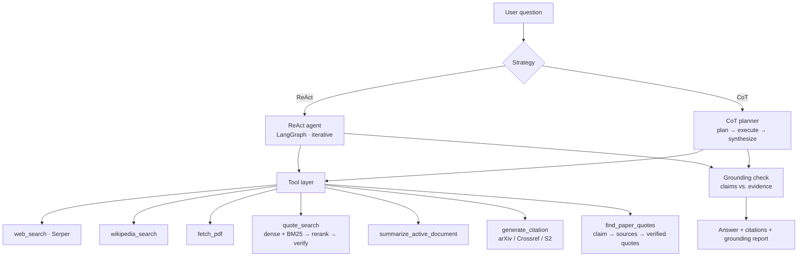
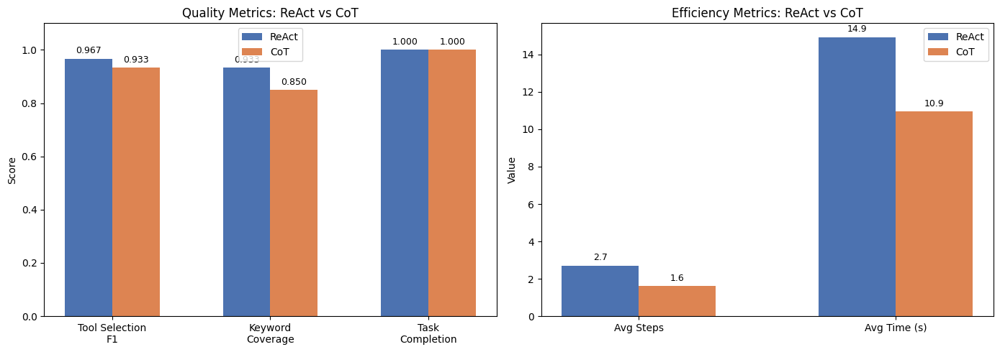

# Research Assistant Agent

> A tool-augmented LLM research assistant that searches, reads, and **cites with verified, source-grounded quotes** — built to compare two agent architectures: **ReAct** vs. a **plan-then-execute Chain-of-Thought** planner.

[](https://github.com/zzzjpete/5293-LLM-project/actions/workflows/tests.yml)


Most "research agents" will happily invent a quote or a citation. This one is built around the opposite principle: **every quote it returns is verified to appear verbatim in a real source**, and final answers can be re-checked claim-by-claim against the evidence the tools actually retrieved.

The project started as a final project for Columbia University's **STAT GR5293 (Generative AI & LLMs)** and has since been refactored from a single Colab notebook into an installable, tested Python package (`src/research_agent/`).

---

## Highlights

- **Two agent strategies, head-to-head.** A **ReAct** agent (LangGraph, iterative tool choice) vs. a **CoT planner** (emit a JSON tool plan → execute → synthesize). Both are *evaluated*, not just implemented.
- **Hallucination-resistant quoting.** `quote_search` retrieves candidate sentences, reranks them with a cross-encoder, and **verifies each quote by exact substring match** against the source — a returned quote is guaranteed real, with character-level provenance.
- **Answer grounding.** An optional pass splits the final answer into claims and uses an LLM judge (structured Pydantic output) to score each one against the retrieved evidence, flagging unsupported statements.
- **Real citations, never invented.** Metadata is resolved from **arXiv / Crossref / Semantic Scholar** with exact-title / arXiv-id matching; missing fields are left blank rather than guessed.
- **Hybrid retrieval done right.** Dense (`e5`) + lexical (BM25) candidates fused with Reciprocal Rank Fusion, with correct attention-mask mean pooling and configurable model presets.
- **Rigorous evaluation.** A curated benchmark, an ablation, an academic-quote-retrieval benchmark, and **HotpotQA (100 questions)** — with non-parametric significance testing (Wilcoxon signed-rank).
- **Engineered like a real project.** Installable package, **52 passing tests** (including a regression guard for a subtle embedding bug), CI, and reproducibility docs.

---

## Architecture



Seven tools, a configurable backbone (currently `gpt-4o-mini`), and a router that lets the **chosen strategy** drive execution while a specialized tool is offered only as a hint.

---

## Quickstart

```bash
git clone https://github.com/zzzjpete/5293-LLM-project
cd 5293-LLM-project

python -m venv .venv
source .venv/bin/activate          # Windows: .venv\Scripts\Activate.ps1

pip install -r requirements.txt
pip install -e .

cp .env.example .env               # then add OPENAI_API_KEY and SERPER_API_KEY
```

Ask a question, with an optional claim-level grounding check:

```python
from research_agent import answer

result = answer(
    "What is LoRA and why is it more efficient than full fine-tuning?",
    strategy="ReAct",   # or "CoT"
    ground=True,
)
print(result["output"])
print(result["tools_used"], result["num_steps"])
print(result["grounding"])          # per-claim: supported / unsupported
```

Verified quoting over a document you load:

```python
from research_agent import set_active_document, run_react, extract_text_from_pdf_bytes

with open("paper.pdf", "rb") as f:
    text = extract_text_from_pdf_bytes(f.read())
set_active_document(text, "My Paper")

print(run_react("Find 3 quotes about why self-attention beats recurrence.")["output"])
```

---

## Evaluation

Full code in [`notebooks/evaluation.ipynb`](notebooks/evaluation.ipynb).

| Study | What it measures | Headline result |
|---|---|---|
| **Curated benchmark** | Tool-selection F1, keyword coverage, answer similarity, completion, steps, runtime | ReAct explores tools better; CoT is cheaper |
| **HotpotQA (n=100)** | Exact match, token-F1, steps, time, max-iteration failures | CoT slightly higher accuracy (**not significant**, Wilcoxon); ReAct costs more and fails more |
| **Ablation** | Remove `quote_search` from the toolset | General tools recover *some* info but lose exact-quote verification and provenance |
| **Academic quote retrieval** | Verified-quote rate, claim coverage, citation-readiness | `find_paper_quotes` returns verified, claim-level quotes vs. plausible-but-unverified web snippets |



**Takeaway:** the two strategies trade off adaptivity vs. cost about as theory predicts. The more interesting finding is that **citation quality requires verification, not just search** — exact, inspectable, source-grounded evidence is what separates this from a generic web agent.

---

## Tools

| Tool | Purpose |
|---|---|
| `web_search` | Current facts via the Serper API |
| `wikipedia_search` | Stable background knowledge |
| `fetch_pdf` | Download + extract PDF text (auto-converts arXiv abstract links) |
| `quote_search` | Exact, verified quotes from the active document |
| `summarize_active_document` | Summarize / answer over the loaded document |
| `generate_citation` | Conservative citation from real metadata (no guessing) |
| `find_paper_quotes` | Claim → find sources → mine + verify supporting quotes |

---

## Testing

```bash
pip install -r requirements.txt -r requirements-evaluation.txt
pip install -e .
pytest -q          # 52 tests
```

Tests cover the deterministic core — text cleaning, RRF, quote verification, routing, citation formatting, claim extraction — and include a **batch-invariance regression test** that fails if the embedding mean-pooling bug ever returns (naive mean-over-all-tokens dilutes shorter sentences under padding; the fix uses attention-mask-weighted pooling).

---

## Project structure

```text
src/research_agent/        # the package
  documents.py             #   PDF/text loading, sentence pooling
  embeddings.py            #   e5 (masked mean pooling) + cross-encoder, model presets
  quote_search.py          #   hybrid dense+BM25 retrieval (RRF) + exact verification
  routing.py               #   strategy-driven routing (tool = hint, not bypass)
  grounding.py             #   claim extraction + LLM-judge grounding report
  citations.py             #   arXiv / Crossref / Semantic Scholar metadata
  tools.py / paper_quotes.py / agents.py   # 7 tools, ReAct (LangGraph) + CoT + answer()
src/extract_pdf_text_with_ocr.py           # OCR helper for scanned PDFs
tests/                     # 52 pytest tests + lightweight smoke checks
notebooks/
  demo.ipynb               # original Colab demo + Gradio UI
  evaluation.ipynb         # ReAct vs. CoT / HotpotQA / ablation / significance tests
docs/                      # experiment setup + troubleshooting
results/                   # generated figures
test_cases/                # sample PDFs / scanned PDF / text for the upload demo
```

The package is the source of truth; `notebooks/demo.ipynb` is preserved as the original Colab artifact.

---

## Limitations & roadmap

- Single backbone (`gpt-4o-mini`); a full multi-model abstraction is in progress.
- `quote_search` indexes one active document at a time — multi-document / vector-DB persistence is planned.
- No response caching yet (web / PDF / embeddings) — the main pending performance item.
- The Gradio demo currently routes some queries past the agent; a clean UI port is planned.
- Structured outputs (Pydantic) for the CoT/claim planners are partially done.

---

## Acknowledgements

Originally developed as a final project for Columbia University's STAT GR5293 (Generative AI & LLMs); this repository is a refactored, hardened version focused on code quality, evaluation, and reproducibility.
